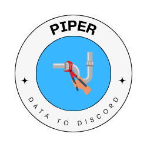

<h1 align="center">
  <br>
  <a href="https://github.com/AndrewVota/piper"></a>
  <br>
  Piper
  <br>
</h1>

<h4 align="center">A tool to pipe std.in or std.out to Discord, available as a CLI application or a Golang package.</h4>

<p align="center">
  <a href="#key-features">Key Features</a> •
  <a href="#how-to-use">How To Use</a> •
  <a href="#cli-options">CLI Options</a> •
  <a href="#config-file-settings">Config File Settings</a> •
  <a href="#download">Download</a>
</p>


## Key Features

* Pipe std.in or std.out to Discord
* CLI application and Golang package support
* Easy installation
* Cross platform

## How To Use

### Creating a Discord App

To use Piper with Discord, you'll need to create a Discord app and obtain a bot token. Follow these steps:

1. **Go to the Discord Developer Portal**:
   - Visit the [Discord Developer Portal](https://discord.com/developers/applications).

2. **Create a New Application**:
   - Click on "New Application".
   - Give your application a name and click "Create".

3. **Create a Bot**:
   - Navigate to the "Bot" tab on the left sidebar.
   - Click "Add Bot" and confirm by clicking "Yes, do it!".
   - Keep the token safe by clicking "Copy" under the "TOKEN" section. You will need this token for Piper.

4. **Invite the Bot to Your Server**:
   - Go to the "OAuth2" tab on the left sidebar.
   - Under "OAuth2 URL Generator", select "bot" in the "SCOPES" section.
   - In the "BOT PERMISSIONS" section, select "Send Messages" and "Manage Messages".
   - Copy the generated URL and paste it into your browser. Select the server you want to invite the bot to and authorize the bot.

5. **Get the Channel ID**:
   - Open Discord and go to "User Settings" > "Advanced" > enable "Developer Mode".
   - Right-click on the channel where you want the messages to be sent and select "Copy ID".

Now you have everything you need to configure Piper with your Discord bot.

### CLI Application

To use Piper as a CLI application, install it using the following command:

```bash
curl -sSfL https://raw.githubusercontent.com/AndrewVota/piper/main/install.sh | sh
```

Then, you can run the application from your terminal:

```bash
# Pipe std.in to Discord
# You can create a config file to forego arguments
# Default location to create it: $HOME/.piper.yaml
$ echo "Hello, Discord!" | piper --token "your_secret_token" --channelID "your_channel_id"
```

### Golang Package

To use Piper as a Golang package, install it using:

```bash
go get github.com/andrewvota/piper
```

Then, import and use it in your Golang code:

```go
package main

import (
    "github.com/andrewvota/piper"
)

func main() {
    pipe, err := piper.NewPipe("your_secret_token", "your_channel_id")
    if err != nil {
        fmt.Printf("error creating pipe: %s", err)
    }

    err = pipe.Start()
    if err != nil {
        fmt.Printf("error starting piper: %s", err)
    }
    defer pipe.Stop()

    // Rest of your program...
    fmt.Println("Hello, World.") // This will be sent to discord!
}
```

## CLI Options

The Piper CLI supports the following options:

* `--token` - Discord bot token
* `--channelID` - Discord channel ID
* `--config` - Config file (default is $HOME/.piper.yaml)

## Config File Settings

You can configure Piper using a config file. The config file will be searched for at `~/.piper/config.yaml`. The following settings are available:

* `token` - Discord bot token
* `channelID` - Discord channel ID

Example config file:

```yaml
token: your_secret_token
channel: your_channel_id
```

## Download

You can download the latest version of Piper from the [releases page](https://github.com/AndrewVota/piper/releases).

## License

MIT

---

> Website [Vota.cc](https://www.vota.cc) &nbsp;&middot;&nbsp;
> GitHub [@AndrewVota](https://github.com/AndrewVota) &nbsp;&middot;&nbsp;
> LinkedIn [@AndrewVota](https://linkedin/in/AndrewVota) &nbsp;
